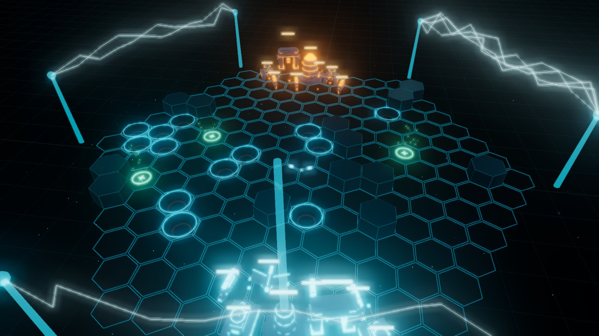
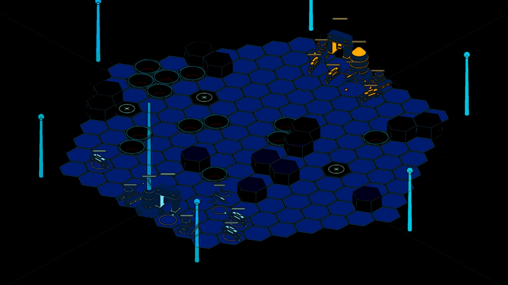
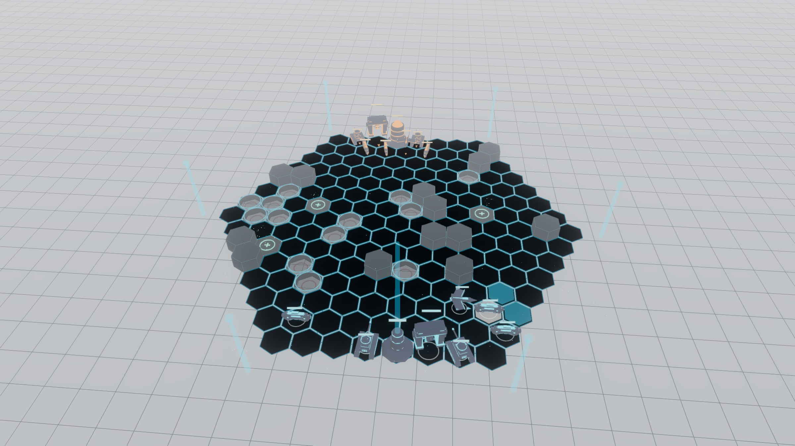
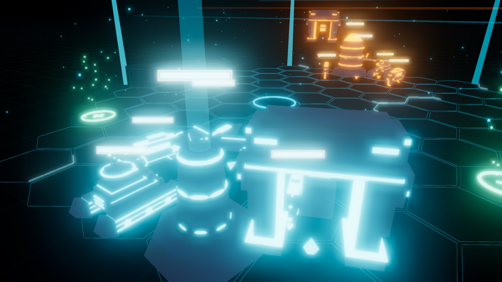

# GRID WARS — a TRON tactics game

> ## ⚠️ Disclaimer — untested, AI-generated software
>
> **This project was generated in its entirety by an AI and has not been
> reviewed, tested, or verified for correctness, security, or safety.** It is an
> experimental novelty with **no guarantee that it works** and is **not fit for
> any purpose**. It is provided **"AS IS", without warranty of any kind**, express
> or implied, including but not limited to the warranties of merchantability,
> fitness for a particular purpose, and non-infringement.
>
> **Use entirely at your own risk.** The authors and contributors accept **no
> liability** for any loss, damage, data loss, security incident, or other harm
> arising from its use. Do not deploy it in production or any environment where
> failure, downtime, or a vulnerability would matter. By using, running, building,
> or distributing this software you accept full responsibility for doing so.

A turn-based strategy game on a 3D hexagonal grid — single-player against the
MCP or online with friends — styled after the original 1982 TRON film: dark
world, glowing cyan and orange circuitry, bloom, light trails and derez effects.
Built with three.js — all models are procedural and all sound effects are
synthesized with the Web Audio API, so there are no asset files and no build step.

Two render styles ship in the box (toggle any time): a **modern** look with bloom
and FXAA-smoothed light walls, and a **classic 16-bit** look with a posterised
palette and dark outlines. A **light / dark** theme toggle switches between the
deep-grid night look and a pale "Amiga LightWave" workstation look. The interface
is responsive and touch-aware, so it plays on phones and tablets as well as
desktop.

## Screenshots

| | |
|:---:|:---:|
|  |  |
| **Modern** — bloom + FXAA-smoothed light walls | **Classic 16-bit** — posterised palette, dark outlines, iso camera |
|  |  |
| **Light mode** — pale "Amiga LightWave" workstation look | **Close-up** — procedural units, health bars and glowing walls |

## Run

```
npm install
node server.js
```

Then open http://localhost:8123. The Node server serves the game AND relays
online multiplayer. An internet connection is needed for the three.js CDN
and the Orbitron font.

(Single-player also works from any static server — `npx http-server . -p 8123`
— only the INVITE/join features need `server.js`.)

### Install from Docker Hub (easiest)

A prebuilt image is published on Docker Hub:
**[`loosecannons/grid-wars`](https://hub.docker.com/r/loosecannons/grid-wars)**.
No clone, no Node, no `npm install` — just Docker:

```bash
docker run -d --name gridwars -p 8123:8123 loosecannons/grid-wars:latest
```

Then open **http://localhost:8123**. Stop it again with `docker rm -f gridwars`.

- **Pin a version:** `loosecannons/grid-wars:1.3.1` (tags: `latest`, `1.3.1`, `1.3.0`, `1.2.1`, `1.2.0`, `1.1.0`, `1.0.0`).
- **Different host port:** `-p 9000:8123` → http://localhost:9000.
- **docker compose:**

  ```yaml
  services:
    gridwars:
      image: loosecannons/grid-wars:latest
      ports: ["8123:8123"]
      restart: unless-stopped
  ```

The container serves the game **and** the multiplayer relay. The browser loads
three.js from a CDN at runtime, so clients need internet access. Full image docs
(tags, env vars, multiplayer exposure, healthcheck) are in [`DOCKER.md`](DOCKER.md).

### Build the image yourself

From the included `Dockerfile` (game + multiplayer relay):

```bash
docker build -t gridwars .
docker run -p 8123:8123 gridwars
# or: docker compose up --build
```

Override the in-container port with `-e PORT=9000` (and map it).

### Desktop app (Windows, macOS & Linux)

Desktop builds are attached to each [GitHub release](https://github.com/loosecannons/grid-wars/releases):

- **Windows** — `GRID-WARS-<version>-portable.exe`. Download and double-click; no install.
- **macOS** — `GRID-WARS-<version>-universal.dmg` (Apple Silicon + Intel). Open it and drag the app to Applications.
- **Linux** — `GRID-WARS-<version>-x86_64.AppImage`. `chmod +x` it and run; no install.

Each is an [Electron](https://www.electronjs.org/) wrapper that runs the bundled
game **and** the multiplayer relay in a native window, so single-player and
hosting/joining online games both work. (three.js and the Orbitron font still
load from a CDN, so it needs an internet connection.)

> **macOS:** the build is **unsigned** (no Apple Developer certificate), so
> Gatekeeper will warn on first launch. Right-click the app → **Open** (then
> confirm), or run `xattr -dr com.apple.quarantine "/Applications/GRID WARS.app"`.

Build them yourself: `npm install electron electron-builder`, then
`npm run dist:win`, `npm run dist:mac`, or `npm run dist:linux` (output in
`dist-exe/`). The builds are produced in CI by
[`build-windows.yml`](.github/workflows/build-windows.yml),
[`build-mac.yml`](.github/workflows/build-mac.yml) and
[`build-linux.yml`](.github/workflows/build-linux.yml).

## Online multiplayer

**Pre-game lobby** (recommended): on the combatant setup screen, press
**OPEN LOBBY**. A lobby opens with a room code, JOIN/WATCH URLs with copy
buttons, and a live roster — open PLAYER slots fill as friends open the
join link. Press START THE GRID and the game launches for everyone at once.

**Mid-game**: open **☰ MENU → INVITE / SPECTATE** — the same dialog opens a
room for the running game; joiners receive a live snapshot and take over an
unclaimed human faction from its next turn. Two URL kinds either way:

- `...?join=ROOM` — a friend opens it and is assigned the next free
  human faction; their turns are played from their own browser.
- `...?watch=ROOM` — spectators see the battle unfold live, with chat.

The host's browser is authoritative (it runs the MCP factions); everyone
runs the same deterministic simulation and only actions travel the wire.
Until someone joins, the host plays unclaimed human factions hotseat —
control hands over cleanly at the start of the faction's next turn.
If a player disconnects, the host takes their programs back over.

## Game modes

- **TUTORIAL — Basic Training**: five guided lessons, one unit system at a
  time (light cycles, tanks, recognizers, energy & conquest, graduation),
  each with a mission briefing. Missions unlock in order.
- **CAMPAIGN — The Grid War**: five escalating missions, from a lone outer
  sentry to the heart of the MCP with TRON fighting at your side. Progress
  is saved; winning offers the next mission directly.
- **SKIRMISH**: free play — pick a map size and set up any combatants.

On the combatant screen a **TURN MODE** toggle chooses how turns work:

- **SEQUENTIAL** (default): factions act one after another in initiative order.
- **SIMULTANEOUS (WeGo)**: every faction plans its orders first — click a unit,
  then a hex to plan its move (a ghost ring + line previews it) and/or a
  red enemy to plan an attack — then press **COMMIT**. Once all factions have
  committed, every move and attack resolves **at once**: units advance together
  (collisions are resolved by initiative so two units never share a hex), then
  all attacks fire simultaneously with damage applied as a batch, so two units
  can destroy each other and a target that moves out of the way is missed.
  Simultaneous mode is local/hotseat + AI; it simplifies a few sequential-only
  mechanics (velocity/overdrive, push and conquest, tank turret arc).

## Interface, themes & controls

A small **icon bar at the top-right of every screen** holds:

- **🔊 Sound** — mute / unmute all audio (a slash crosses the speaker when muted).
- **🌓 Theme** — switch between the **dark** TRON-night look and a **light**
  workstation look (light-grey background, dark text — a nod to LightWave 3D on
  the Amiga). Bloom softens in light mode.
- **ⓘ Info** — toggle the on-screen instructions overlay. Only shown *during a
  game*, not on the start/setup screens.

In-game extras:

- **↶ UNDO** — take back a unit's **move** (only its move). It's enabled only
  while a take-back is still clean: the moved unit hasn't been damaged,
  destroyed, or attacked anything, and no unit anywhere has been hit since. Any
  fight invalidates the undo.
- **Render style** — modern (bloom + FXAA) or classic 16-bit (posterised +
  outlined). In classic mode the camera is free to orbit, pan and zoom with no
  fixed-angle lock.
- **Camera** — drag to orbit, scroll to zoom. Focusing on a unit (NEXT UNIT /
  undo) pans the camera **without rotating**, so the view never disorients you.
- **Touch** — tap a unit to select, tap a highlighted hex/enemy once to preview
  and again to confirm; targets are finger-sized.

## Custom game rules

On the combatant setup screen, **GAME RULES** opens an editor to tune the match
before it starts: per buildable unit you can change **HP, movement, damage and
cost**, and you can override the **build credits** (energy income per turn,
which otherwise defaults to the map size). Changes are highlighted, persist in
your browser, and **RESET** returns everything to stock. A custom match never
leaks its values into the next game.

## Map editor & custom maps

Build your own grids and play them. From the start screen:

- **MAP EDITOR** opens a 2D, top-down hex editor. Pick a **size** (S–XL), then
  paint **terrain** (clear / pit / plateau / heal pad) and **place** cores and
  units for each faction. The **FACTION** strip selects which side you're placing
  for (click a swatch to select, double-click to recolour); **+ / −** add or
  remove factions and the **HUMAN / MCP** button sets a faction's controller.
  **▶ PLAY** test-drives the map immediately (the in-game **☰ MENU → ↩ EDITOR**
  jumps straight back to keep tweaking); **SAVE** stores it on the server.
- **CUSTOM MAPS** lists every saved grid — **play**, **EDIT**, or delete it.
- Each faction that has any units needs a **core**, and a map needs at least two
  cored factions before it can be played or saved.

You can also **save a procedurally-generated grid**: in any running game, open
**☰ MENU → SAVE MAP** to store the current terrain *and* unit layout as a custom
map you can replay or edit later.

Maps are stored server-side as JSON (so this needs `server.js`, not a pure static
host). The store lives in `maps/` by default — set `MAPS_DIR` (e.g. a Docker
volume) to keep them across container restarts.

## Chat & voice

A collapsible transmission panel (left) lets human players chat between
turns; in online games **chat and AI barks are broadcast to everyone**. AI
factions talk back in the dialect of the 1982 film — hostile ones like the MCP
("YES.", "NO.", "DEREZZED.", "END OF LINE."), while AIs on a *human's team*
speak like Tron ("I FIGHT FOR THE USERS.", "CORE LIBERATED."). AI transmissions
also **float as fading text above the speaking faction's core**. Toggle
**VOICE** to have all transmissions spoken aloud in a flat machine-like English
voice (browser speech synthesis).

## Sessions & records

Every running game **auto-saves at each turn** under ACTIVE GRIDS on the
start screen — keep several games going at once, resume or discard them
freely (QUIT never loses progress; finished games clean themselves up). Saves
restore the **full board state**, including each unit's facing/altitude, every
standing light wall (per-segment control points), and an approximation of the
ambient particle life, so a resumed or rejoined grid looks the way you left it.
The start screen also shows the hall of fame: top scores per map size.
In-game, RESTART / QUIT / SOUND live behind the ☰ MENU button. On the
end-of-game **replay** screen you can **restart the same map as a fresh game**.

## How to play

**Hotseat multiplayer**: after picking a grid size, set up 2–6 combatants —
each with a name (your login), a colour (the colour *is* the side), a
controller: **PLAYER** (human, plays with the full interface) or **MCP**
(computer), and a **team** (T1–T6). Combatants sharing a team are allies:
they can't hit each other, their walls don't kill each other, and they
**win together** once every rival team's cores have fallen. Any mix works —
2v2, humans vs MCP alliances, free-for-all, or *all* MCPs to sit back and
watch. Factions spawn on their own edge. **Initiative is rolled fresh at the
start of every round** (a new random turn order, announced in chat) — but a
faction that did *nothing* the previous round gets a strong bonus toward going
first, so sitting still is rewarded with the next first strike. A faction
falls when **all** its cores are gone (destroyed or captured) — its entire
remaining force then derezzes, core first. A live
**scorecard** (top right) is sorted with the leader on top and tracks every
combatant's score, team, core count (◆) and army size (⬡).

Pick a grid size on the start screen. Each faction's starting army is
`cycles · tanks · recos · jets`; energy is paid **per core, every turn**:

| Size  | Hexes | Starting army (per faction) | Energy / turn | Max factions |
|-------|-------|-----------------------------|---------------|--------------|
| S     | 91    | 2 · 1 · 1 · 1               | 3             | 3            |
| M     | 169   | 3 · 2 · 1 · 1               | 3             | 4            |
| L     | 271   | 4 · 3 · 2 · 2               | 4             | 6            |
| XL    | 469   | 6 · 4 · 3 · 2               | 5             | 6            |
| XXL   | 1027  | 8 · 6 · 4 · 3               | 6             | 6            |
| EPIC  | 4219  | 16 · 12 · 8 · 6            | 8             | 6            |
| MANIC | 17101 | 32 · 24 · 16 · 12         | 10            | 6            |

EPIC and MANIC are large-scale battles (MANIC is roughly four times EPIC's area
and is flagged ⚠ HEAVY). See **Battle mechanics** below for the default unit
stats — all of which can be retuned per match in the GAME RULES editor.

- Click a unit to select it, a cyan hex to move, a red-highlighted enemy to attack.
- Movement points can be split across several moves; attacking normally ends a
  unit's activation. **Light cycles are the exception**: after striking they may
  make one more move with whatever movement points remain — hit and run.
- **Light cycles carry velocity between turns** (SLOW / CRUISE / FAST, shown
  on the unit card). Straight riding accelerates; gentle 60° turns hold speed
  but are impossible at FAST; extreme 120° curves (+1 movement) demand SLOW;
  U-turns never. A long sprint leaves you FAST — locked into straight lines —
  while a short 1–2 hex step brakes you back down: control your speed with
  the length of your moves. Sitting a turn out coasts back to SLOW, and an
  overdrive slide always leaves you flat out. Cycles run along smooth curves,
  not hex-to-hex zigzags.
- **Light walls**: a moving cycle extrudes a continuous curved glowing wall
  behind it that stands until the start of its side's next turn. Walls of your
  own team are solid — your cycles can never cross them. Any enemy light cycle
  that drives into a wall is derezzed on the spot — and when a cycle is
  derezzed, its own walls collapse with it immediately. The MCP routes around
  your walls; hexes you can reach only by crossing an enemy wall glow orange.
- **Overdrive**: a light cycle that spends its entire movement in a single move
  builds momentum and slides 2 extra hexes straight ahead (tanks are too heavy
  to slide). That extends your effective reach — but the slide is
  uncontrollable: sliding off the map edge slams the cycle into the Grid
  boundary, and sliding into a pit drops it in; both derez the unit. Overdrive
  destinations glow pale; fatal ones glow red.
- **Tank turrets** are player-controllable: with a tank selected, rotate the
  turret in 30° steps (a free action) up to ±60° off the hull. Targets must
  lie within ±60° of the turret's heading, so the gun can never cover the
  rear — flank tanks from behind. The turret holds its world aim while the
  hull drives and turns (it does **not** swing around with the chassis), so
  after manoeuvring you re-aim by rotating it; it also auto-swivels onto its
  target when firing.
- **Focus fire**: every additional attack against the same target in one turn
  hits 25% harder per previous strike — coordinate your units on one victim.
- **Unit inspector**: selecting any unit shows a slowly rotating 3D model next
  to its stats, with battle damage visible on the hull.
- **Terrain**: the Grid is broken by dark **pits** and raised **plateaus**.
  Ground units cannot enter either. Recognizers don't phase through anything:
  they **jump** — over rough terrain and over other units alike — at 2 movement
  points per hex, with a visible hop in their flight path.
- **Directional damage**: every unit shows a facing chevron. Attacks into a
  unit's rear arc deal **+50%** damage (REAR STRIKE); attacks against its front
  arc are **DEFLECTED to 75%**. Position your moves — and watch your backs:
  the MCP actively flanks.
- **Production & economy**: click your Control Core to open the build menu and
  spend energy on new units; they rez in beside the core and act from the next
  turn. Energy is awarded **per core, every turn** — capture an enemy core and
  it adds its income to yours. The MCP builds reinforcements too.
- Recognizers and jets fly over other units.
- **Recognizer altitude** is controllable like a tank turret across three flight
  levels (NORMAL → HIGH → TOP, one change per turn). HIGH gives +1 attack range
  and immunity to light-cycle strikes — but rockets hit a raised recognizer for
  +50% (FLAK). TOP gives +2 range and clears everything, but the recognizer is
  EXPOSED (+2 flat damage per hit) and can crash down onto a unit it hovers over.
  Crippled recognizers (below half structure) fly low and can't climb.
- **Light jets** are the fast, fragile aerial strafer: high movement, a nose
  laser, and they glide over units. They fly across four levels (GROUND →
  NORMAL → HIGH → TOP); **any hit knocks a jet down one level**, and a jet on the
  ground is exposed like a cycle. A jet trails **thin wingtip light walls**:
  airborne, they derez any other jet that flies through them at the same
  altitude; on the ground they behave like cycle walls (deadly to ground units,
  breakable by tanks). Recognizers shear jet walls at their own altitude.
  **Flying through a hostile jet wall at your altitude is fatal** — and the MCP
  flies its jets offensively, laying walls to cut you off.
- **Undo a move**: the ↶ UNDO button (or its hotkey) reverses the last unit's
  move — only its move, and only while nothing has been damaged or attacked
  since.
- **Healing**: units that spend a whole turn doing nothing repair +1. A unit
  that holds a glowing healing pad (rising green motes) for a full round is
  **completely restored** at the start of its next turn. A repaired recognizer
  regains lift.
- Player light cycles **prefer safe routes**: destinations route around enemy
  walls automatically whenever a detour exists; hexes reachable only by
  crossing a wall glow orange.
- Derez explosions scale with the unit's physical size — a falling core is an
  event.
- **Target card**: hovering over a hittable enemy shows a second card with a
  rotating 3D model of the target, its structure/range/power, the exact
  predicted damage, modifiers (rear strike, flak, focus), and whether the hit
  derezzes — the doomed slice of its health bar blinks red. After a hit lands,
  the model jolts and visibly degrades to match its new structure. When the unit
  is **destroyed, its model detonates inside the card** — every part blasting
  apart and fading — and the card lingers on the DEREZZED result before clearing.
- **Varied destruction**: every derez and explosion is built from random
  parameters — fountaining embers, streaking shrapnel, a vertical derez
  column, and a scatter that erupts upward or fans out — so no two kills look
  the same.
- **Tank ram (PUSH MODE)**: a tank beside an enemy light cycle can shove it
  one hex instead of shooting — into a pit, an *enemy* light wall, or off the
  Grid for an instant derez; into anything solid for a slam. Shoved into the
  cycle's **own** wall, that wall shatters and the cycle takes only normal
  damage instead of derezzing.
- **Core conquest**: a light cycle beside an enemy core can channel a
  CONQUEST as its special attack. Two channels by **the same light cycle** on
  consecutive turns capture **that core and every unit it spawned** — the core
  and its programs flip to your colour, and the core starts paying its income
  to you. It does **not** take the faction's *other* cores or the units those
  cores spawned; a faction only falls once it has lost every core (so
  conquering a single-core enemy's core defects their whole army). The channel
  is tied to that one cycle: let it lapse a turn and progress resets, a
  different cycle starts over, and if the conquering cycle is **destroyed the
  core defends itself** ("CONQUEST BROKEN") and the count resets to zero.
- Every unit has its own voice — cycles whine, tanks rumble on a sub-bass,
  recognizers drone in chorus — and every sound is subtly detuned per play.
- **The MCP fights dirty too**: AI tanks ram cycles into pits and walls, and
  AI cycles channel core conquests — and renew them — when they get adjacent.
- **Music**: random synth cues in the spirit of Wendy Carlos's TRON score —
  dark minor pads, square-wave arpeggio runs with ghost echoes, brass swells
  with opening filters, and low ostinati — drop in every 20–40 seconds.
- During any attack (yours or the AI's) both cards show: the attacker's unit
  card and the target card with the incoming hit.
- The Grid itself is alive: beacon pylons pulse at the six corners of the
  arena, data sparks drift up off the floor, energy streaks race across the
  deep grid below, bright pulses zigzag along the gaps between the hex tiles,
  and every Control Core turns slowly in place.
- The generative score draws on Wendy Carlos's TRON vocabulary — random cues
  include a four-bar take on the **main title**, an **Anthem**-style rising
  brass line, a tense **chromatic** descent, dark minor pads, square-wave
  arpeggio runs, brass swells and low ostinati.
- Derezzed units leave glowing voxel wreckage that fades out over three cycles.
- Combat animations start deliberately slow and quicken very slightly with
  every game cycle as the battle heats up.
- **Tanks demolish light walls** by driving through them: the breach severs
  the wall, and the whole stretch no longer connected to the light cycle
  collapses away — only the segment still reaching the bike survives.
- **Damage shows**: the unit inspector loses parts, hangs others askew, and its
  circuitry flickers; engines and weapons sound rougher as structure drops.
  A recognizer below half structure flies low, wobbles, and can no longer
  climb plateaus.
- **Score & highscores**: derezzing MCP units scores points (10× their cost;
  the core counts 200) plus a swift-victory bonus. Top-5 highscores are kept
  per map size in your browser.
- Press **Tab** or the NEXT UNIT button to cycle through units that can still
  act (marked with a pulsing ring); RESTART replays the exact same map
  (terrain is seeded), QUIT returns to grid selection.
- Your turn **ends automatically** when nothing is left to do — no unit can
  move or attack and no new unit can be built.
- **The game ends only** when a side's core is destroyed, or it has no mobile
  units left *and* can't afford to build one.
- Drag to orbit the camera, scroll to zoom.

## Battle mechanics

### Units — default values

These are the stock stats (in `src/constants.js`). HP, movement, damage and cost
for the four buildable units are tunable per match in the **GAME RULES** editor;
range and the special behaviours are fixed.

| Unit          | HP | Move | Range | Power | Cost | Flies | Attack    | Role / special                                            |
|---------------|----|------|-------|-------|------|-------|-----------|-----------------------------------------------------------|
| Light Cycle   | 5  | 4    | 1     | 3     | 4 ⚡ | no    | Dash      | Hit & run; leaves a lethal light wall; can conquer cores  |
| Light Jet     | 5  | 5    | 2     | 3     | 6 ⚡ | yes   | Laser     | Fast, fragile; glides over units; thin wingtip walls      |
| Battle Tank   | 9  | 2    | 4     | 4     | 7 ⚡ | no    | Rocket    | Long-range artillery; ±60° turret; rams & breaches walls  |
| Recognizer    | 14 | 3    | 2     | 3     | 10 ⚡| yes   | Laser     | Durable flier; 3 altitude levels; jumps terrain & units   |
| Control Core  | 24 | —    | —     | —     | —    | no    | —         | Builds units and pays energy; destroy/capture it to win   |

Recognizers pay **2 movement** to enter rough terrain (a pit or plateau) and to
jump; everything else costs 1 per hex. Movement points can be split across
several moves in a turn.

### Damage formula

A hit's damage is computed from the attacker's **Power** and a stack of
multipliers and flat bonuses:

```
damage = max(1, round(Power × facing × flak × (1 + 0.25 × focus))
              + exposed + overdrive)
```

| Factor          | When it applies                                   | Effect          |
|-----------------|---------------------------------------------------|-----------------|
| **facing**      | attack into the target's **rear** arc             | ×1.5 (REAR STRIKE) |
|                 | attack into the target's **front** arc            | ×0.75 (DEFLECTED)  |
|                 | side / no clear facing                            | ×1.0            |
| **flak**        | rocket vs a **HIGH** recognizer                   | ×1.5 (FLAK)     |
| **focus**       | each previous hit on this target **this turn**    | +25% each       |
| **exposed**     | target is a **TOP**-altitude recognizer           | +2 flat         |
| **overdrive**   | attacker is a light cycle at full speed           | +1 flat         |

Every unit shows a facing chevron, so positioning is a real lever: flank for the
rear bonus, keep your own back covered, and stack units on one victim for focus
fire. The MCP applies the same rules and actively flanks.

### Light cycles — velocity & walls

- **Velocity carries between turns** (SLOW / CRUISE / FAST, shown on the card).
  Straight riding accelerates; gentle 60° turns hold speed but are impossible at
  FAST; sharp 120° curves (+1 movement) demand SLOW; U-turns never. A long
  sprint leaves you FAST and locked to straight lines; short steps brake you;
  sitting still coasts back to SLOW. A FAST cycle that isn't moved coasts on.
- **Overdrive**: spend your whole movement in a single straight move and the
  cycle slides **2 extra hexes** ahead and strikes for +1 — but the slide is
  uncontrollable, and sliding into a pit or off the Grid derezzes you. _(Hit the
  boundary hard enough and the wall might crack — find out what happens next.)_
- **Light walls** stand until the start of your side's next turn. Your own
  team's walls are solid to you; any enemy cycle that drives into a wall is
  derezzed, and a derezzed cycle's walls collapse with it. Tanks demolish walls
  by driving through (the disconnected stretch falls away).
- **Core conquest**: a cycle beside an enemy core can channel CONQUEST; two
  channels by the **same cycle** on consecutive turns flip that core and every
  unit it spawned to your colour. Destroy the channelling cycle (or let it lapse)
  and the count resets.

### Tanks, recognizers, jets

- **Tank turret**: rotate in 30° steps up to ±60° off the hull (a free action);
  targets must lie within 60° of where the turret points, so the gun never
  covers the rear. The turret holds its world aim as the hull drives.
- **Tank ram (PUSH MODE)**: shove an adjacent enemy cycle one hex — into a pit,
  an enemy wall, or off the Grid for an instant derez; into its **own** wall and
  that wall shatters for normal damage instead.
- **Recognizer altitude**: NORMAL → HIGH (+1 range, cycle-immune, but FLAK from
  rockets) → TOP (+2 range, over everything, but EXPOSED +2/hit and can crash
  onto a unit below). One change per turn; crippled recos can't climb.
- **Jet altitude**: GROUND → NORMAL → HIGH → TOP. Every hit drops a jet one
  level; on the ground it's exposed. Airborne jets glide over units and trail
  thin wingtip walls that kill other jets at the same altitude and are sheared by
  recognizers; grounded jet walls act like cycle walls (tank-breakable).

### Healing, economy & turn order

- **Healing**: a unit that does nothing for a whole turn repairs +1; a unit that
  holds a glowing healing pad for a full round is **completely restored** at the
  start of its next turn (and a repaired recognizer regains lift).
- **Economy**: each core pays its energy **every turn**; capture an enemy core
  and its income is added to yours. Build new units at your core — they rez in
  beside it and act from the next turn.
- **Initiative** is rolled fresh each round (announced in chat), but a faction
  that did **nothing** the previous round gets a strong bias toward going first —
  so holding still earns the next first strike.
- **Victory**: a faction falls when **all** its cores are gone; its whole army
  then derezzes, core first. Allies (shared team) win together once every rival
  team's cores have fallen. Derezzed units leave glowing voxel wreckage that
  fades over three game cycles.

## How this was built

GRID WARS was generated **entirely by AI** from natural-language prompts — no
hand-written code. Two artifacts document that:

- **[prompts.md](prompts.md)** — the full sequential history of the ~140 prompts
  that produced the game, in order, with the model used for each phase (initial
  creation with **Claude Fable 5**, then expansion and polish with **Claude Opus
  4.8**), via [Claude Code](https://claude.com/claude-code).
- **[createPrompt.md](createPrompt.md)** — a single, structured spec-prompt that
  folds the finished design into one document, intended to recreate the project
  as it stands today in one shot.

(See the disclaimer at the top regarding the untested, AI-generated nature of
this software.)

## Code layout

- `src/main.js` — renderer, bloom + FXAA + posterize post-processing, render
  modes, themes, camera, picking, game loop
- `src/game.js` — board, units, turn flow, actions, production, directional
  damage, altitudes, light walls, conquest, undo, save/restore, victory
- `src/ai.js` — the MCP commander (flank- and wall-aware move/attack scoring,
  offensive jet play, build phase)
- `src/hex.js` — axial hex math, BFS movement, pathfinding
- `src/models.js` — procedural light cycles, jets, tanks, recognizers, cores, tiles
- `src/effects.js` — explosions, lasers, rockets, light walls, derez, materialize, damage text
- `src/preview3d.js` — the rotating 3D unit/target card models (hit, degrade, detonate)
- `src/ui.js` — HUD, cards, scorecard, lobby roster, chat, the GAME RULES editor
- `src/net.js` — online multiplayer (lockstep relay, host authority, snapshots)
- `src/audio.js` — synthesized sound effects, voices, ambient Grid hum, music cues
- `src/constants.js` — unit stats, costs, tunable rules, team colors, map sizes, formation generator
- `server.js` — static file server + WebSocket relay for online play
